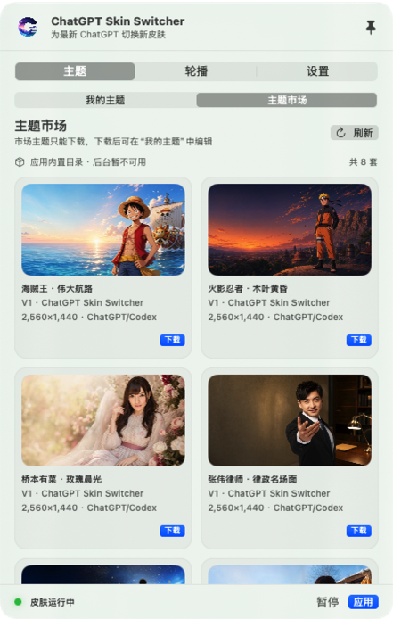
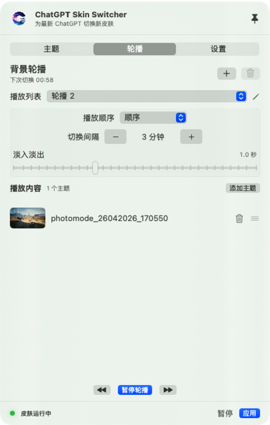
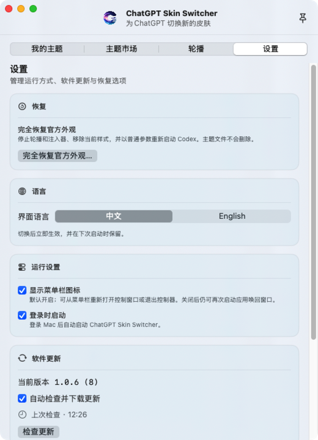
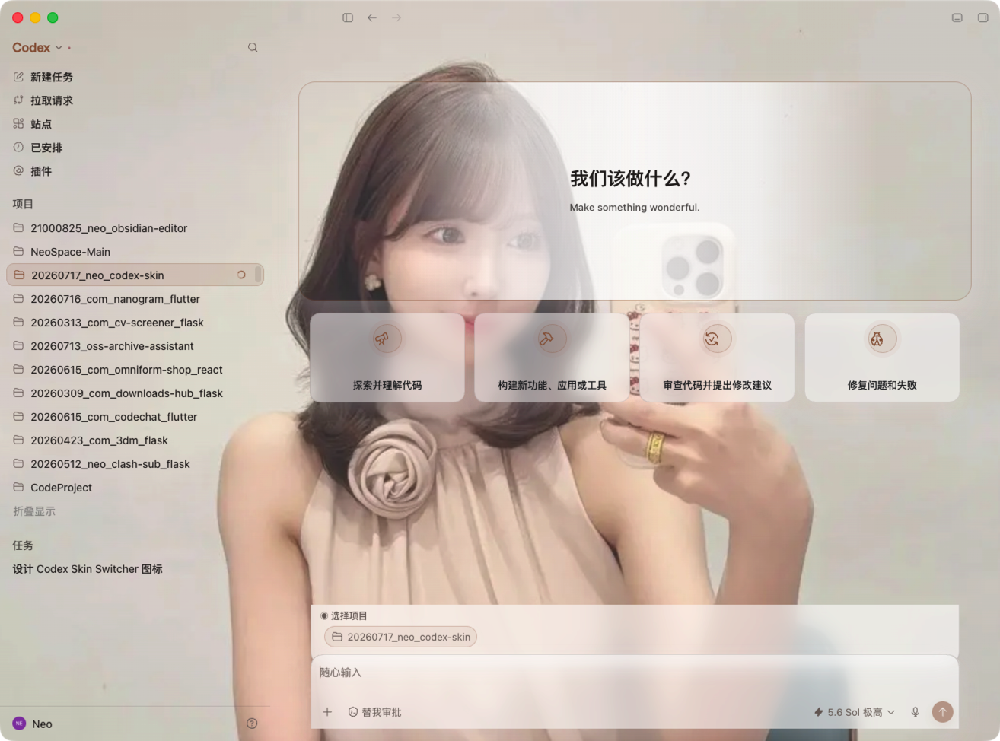

<p align="center">
  
</p>

<h1 align="center">ChatGPT Skin Switcher</h1>

<p align="center">
  <strong>让 ChatGPT 与 Codex，拥有你的工作氛围。</strong><br>
  <em>Give ChatGPT and Codex a workspace that feels like yours.</em>
</p>

<p align="center">
  <a href="#简体中文"></a>
  <a href="#english"></a>
</p>

<p align="center">
  
  
  
  
</p>

> [!IMPORTANT]
> This is the official **public showcase repository** for ChatGPT Skin Switcher. It contains product documentation, approved theme packages, screenshots, and a few reference code files. The production application and its core source code are not included.

> [!NOTE]
> ChatGPT Skin Switcher is an independent third-party project and is not affiliated with or endorsed by OpenAI. ChatGPT, Codex, and related trademarks belong to their respective owners.

## 简体中文

ChatGPT Skin Switcher 是一款面向 macOS 最新版官方 ChatGPT Desktop 的原生菜单栏换肤工具。你可以让 ChatGPT 与 Codex 共用一套背景，也可以分别设置图片、焦点、缩放、透明度、模糊与遮罩，并把多个完整主题加入播放列表自动轮播。

项目坚持本地优先与非侵入式设计：个人图片和主题配置保存在本机，不上传云端；不会修改官方 `ChatGPT.app`、`app.asar` 或代码签名，也不会读取或修改 API Key、Base URL 和模型供应商设置。

### 主要能力

- ChatGPT / Codex 全局或双场景主题
- 图片焦点、缩放、透明度、模糊和遮罩调节
- 本地主题资料库与八套内置主题
- 顺序或随机背景轮播与平滑转场
- 中文 / English 界面
- 暂停换肤与完全恢复官方外观

### 产品界面

<table>
  <tr>
    <td width="33%" align="center"><br><sub>主题市场</sub></td>
    <td width="33%" align="center"><br><sub>背景轮播</sub></td>
    <td width="33%" align="center"><br><sub>中英文与运行设置</sub></td>
  </tr>
</table>

### 八套内置主题

<table>
  <tr>
    <td width="25%" align="center"><br><sub>海贼王 · 伟大航路</sub></td>
    <td width="25%" align="center"><br><sub>火影忍者 · 木叶黄昏</sub></td>
    <td width="25%" align="center"><br><sub>桥本有菜 · 玫瑰晨光</sub></td>
    <td width="25%" align="center"><br><sub>张伟律师 · 律政名场面</sub></td>
  </tr>
  <tr>
    <td width="25%" align="center"><br><sub>GOAT</sub></td>
    <td width="25%" align="center"><br><sub>东北雨姐 · 冬日小院</sub></td>
    <td width="25%" align="center"><br><sub>易烊千玺 · 清透鼠尾草</sub></td>
    <td width="25%" align="center"><br><sub>三上悠亚 · 樱光花园</sub></td>
  </tr>
</table>

每套目录均包含 ChatGPT 背景、Codex 背景、预览图和 Manifest V1 清单。它们与应用安装包中的八套内置主题保持一致，详见 [`themes/`](themes/)。人物、角色、球队元素、商标和相关图片不因本仓库公开而自动获得 MIT 或其他开源授权，具体边界见 [`LICENSE.md`](LICENSE.md)。

### 运行效果

<table>
  <tr>
    <td width="50%" align="center"></td>
    <td width="50%" align="center"></td>
  </tr>
  <tr>
    <td width="50%" align="center"></td>
    <td width="50%" align="center"></td>
  </tr>
</table>

### 系统要求

- macOS 14 或更高版本
- Apple Silicon 或 Intel Mac
- 最新版官方 ChatGPT Desktop（Bundle ID：`com.openai.codex`）

### 源码说明

本仓库不是完整开源仓库，不能用于构建生产版应用。`examples/` 只包含经过筛选的主题包数据模型与通用原子写入示例；主界面、业务逻辑、运行时、后端、构建与签名流程均未公开。详情见 [`SOURCE_AVAILABILITY.md`](SOURCE_AVAILABILITY.md)。

---

## English

ChatGPT Skin Switcher is a native macOS menu-bar app for the latest official ChatGPT Desktop. It supports shared or scene-specific backgrounds for ChatGPT and Codex, fine visual tuning, a local theme library, and automatic theme slideshows.

The product is local-first and non-invasive. Personal images and theme settings remain on the Mac. It does not modify the official app, `app.asar`, or its code signature, and it does not access API keys, base URLs, or model-provider settings.

This repository intentionally publishes only the product presentation, the eight approved bundled themes, screenshots, and selected reference code. It is not sufficient to build the production app. See [Source availability](SOURCE_AVAILABILITY.md) and [Licensing](LICENSE.md) for the exact boundary.

## Repository contents

```text
assets/       Approved branding and product screenshots
examples/     Selected non-core Swift reference files
themes/       Eight theme packages bundled with the app
```

## License and asset rights

The selected files in `examples/` are available under the MIT terms in [`LICENSE.md`](LICENSE.md). Branding, screenshots, portraits, characters, team elements, trademarks, and theme artwork are governed separately and are not automatically covered by that MIT grant.
