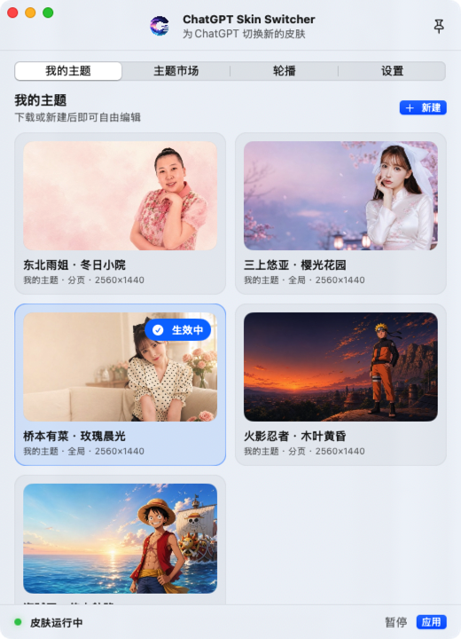
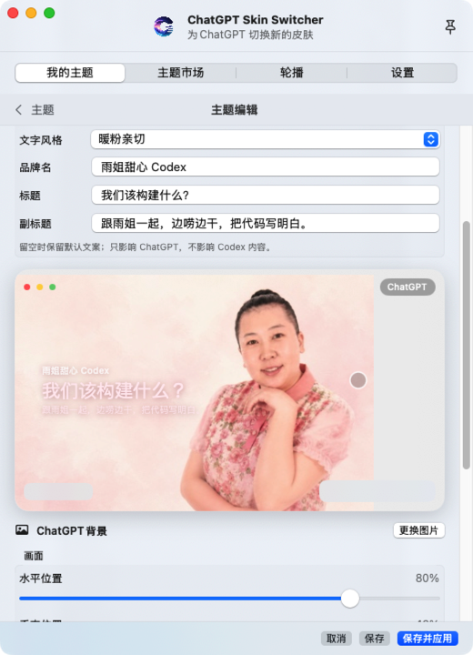
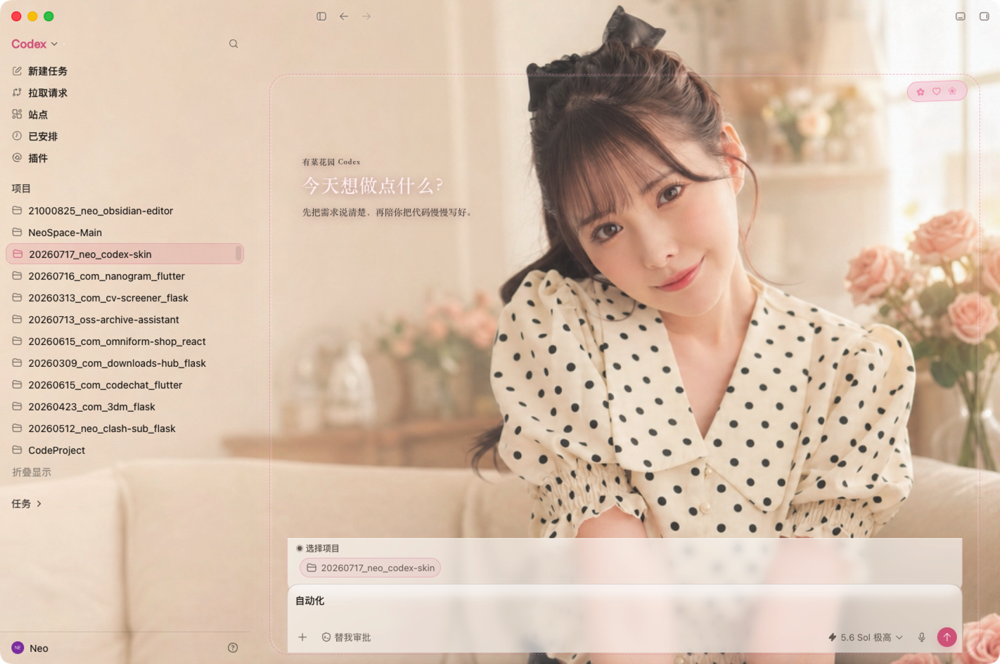
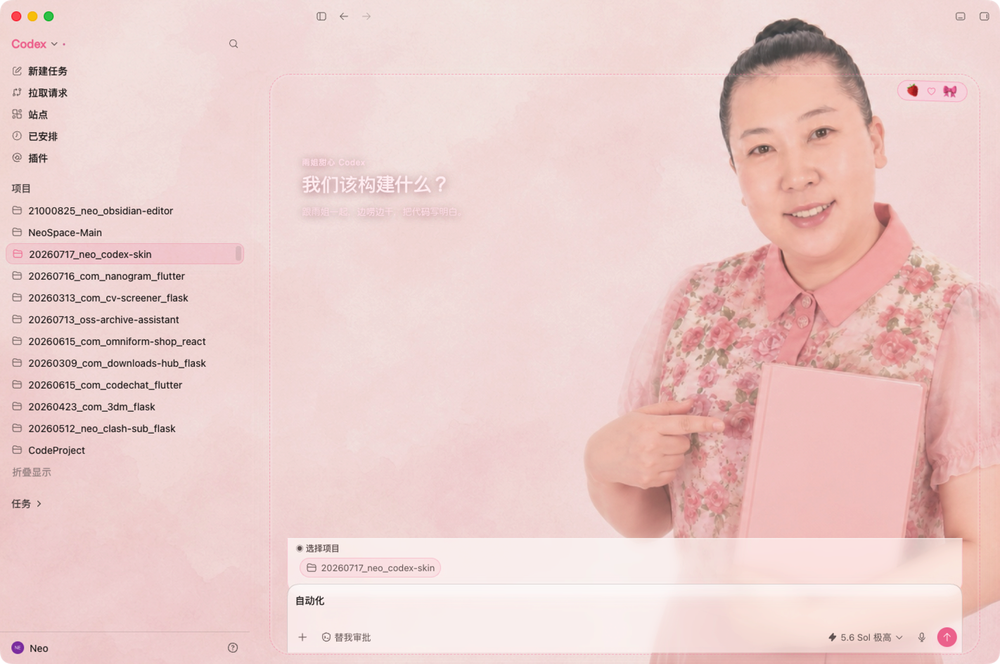
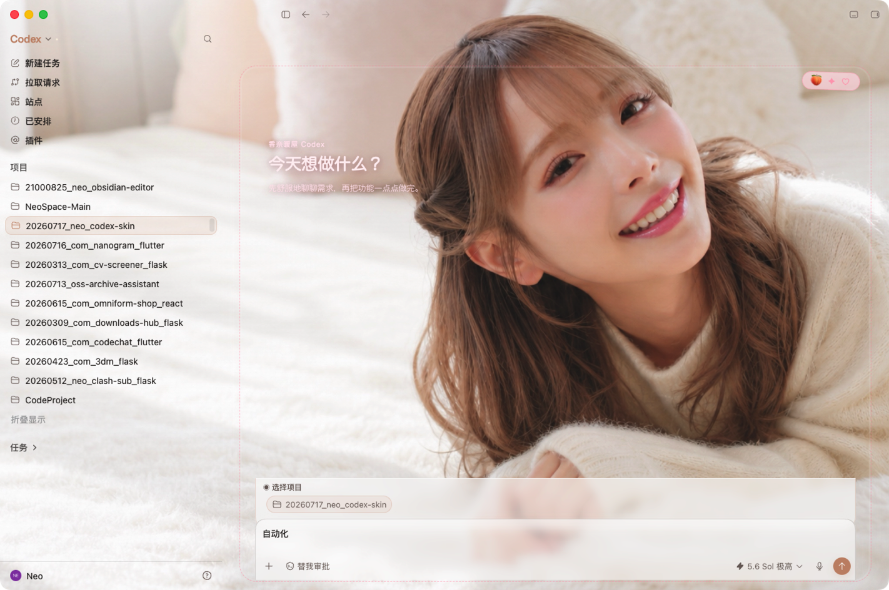

<p align="center">
  
</p>

<h1 align="center">ChatGPT/Codex Skin Switcher</h1>

<p align="center">
  <strong>Give ChatGPT and Codex a workspace that feels like yours.</strong>
</p>

<p align="center">
  <a href="README.md"></a>
  
</p>

<p align="center">
  
  
  
  
</p>

<h2 align="center">Download ChatGPT Skin Switcher</h2>

<p align="center">
  <a href="https://github.com/RoperYoung/chatgpt-codex-skin-switcher/releases/download/v1.0.7/ChatGPT-Skin-Switcher-1.0.7-build9-notarized.dmg"></a>
</p>

<p align="center">
  <sub>v1.0.7 (build 9) · macOS 14+ · Apple Silicon + Intel · App and DMG both Apple-notarized</sub>
</p>

<p align="center">
  <strong><a href="https://github.com/RoperYoung/chatgpt-codex-skin-switcher/releases/tag/v1.0.7">Release notes and SHA-256</a></strong>
  &nbsp;·&nbsp;
  <a href="https://github.com/RoperYoung/chatgpt-codex-skin-switcher/releases">All stable releases</a>
</p>

<p align="center">
  <sub>Windows version in development</sub>
</p>

To install: click the blue button above to download the DMG, open it, drag **ChatGPT Skin Switcher.app** along the arrow into **Applications**, then launch it from Applications.

> [!IMPORTANT]
> This is the official public showcase repository for ChatGPT Skin Switcher. It contains product documentation, approved theme packages, screenshots, and a few reference code files. The production application and its core source code are not included.

> [!NOTE]
> ChatGPT Skin Switcher is an independent third-party project and is not affiliated with or endorsed by OpenAI. ChatGPT, Codex, and related trademarks belong to their respective owners.

## Overview

ChatGPT Skin Switcher is a native macOS menu-bar app for the latest official ChatGPT Desktop. Choose or drag in your own images from your Mac, share one background across ChatGPT and Codex, or configure each scene separately with its own image, focus, scale, opacity, blur, and overlay. Complete themes can also be added to playlists for automatic rotation.

The product is local-first and non-invasive. Personal images and theme settings remain on your Mac and are never uploaded to the cloud. It does not modify the official `ChatGPT.app`, `app.asar`, or its code signature, and it does not access or change API keys, base URLs, or model-provider settings.

### Highlights

- **Use your own local images:** Choose or drag in images from your Mac, share one background, or configure ChatGPT and Codex separately; images are never uploaded to the cloud
- Shared or scene-specific ChatGPT / Codex themes
- Focus, scale, opacity, blur, and overlay controls
- Local theme library with sixteen bundled themes
- Sequential or random slideshows with smooth transitions
- Chinese and English interface
- Pause theming or completely restore the official appearance

### Product interface

<table>
  <tr>
    <td width="50%" align="center"><br><sub>My themes</sub></td>
    <td width="50%" align="center"><br><sub>Theme market</sub></td>
  </tr>
  <tr>
    <td width="50%" align="center"><br><sub>Theme editor</sub></td>
    <td width="50%" align="center"><br><sub>Background slideshow</sub></td>
  </tr>
  <tr>
    <td colspan="2" align="center"><br><sub>Language, runtime, and restore settings</sub></td>
  </tr>
</table>

### Sixteen bundled themes

<table>
  <tr>
    <td width="50%" align="center"><br><sub>One Piece · Grand Line</sub></td>
    <td width="50%" align="center"><br><sub>Naruto · Konoha Dusk</sub></td>
  </tr>
  <tr>
    <td width="50%" align="center"><br><sub>Arina Hashimoto · Rose Dawn</sub></td>
    <td width="50%" align="center"><br><sub>Attorney Zhang Wei · Courtroom Classic</sub></td>
  </tr>
  <tr>
    <td width="50%" align="center"><br><sub>GOAT</sub></td>
    <td width="50%" align="center"><br><sub>Jackson Yee · Sage and Crane</sub></td>
  </tr>
  <tr>
    <td width="50%" align="center"><br><sub>Yua Mikami · Cherry Glow</sub></td>
    <td width="50%" align="center"><br><sub>Dongbei Yujie · Winter Yard</sub></td>
  </tr>
  <tr>
    <td width="50%" align="center"><br><sub>Dilraba · Silk Road Garden</sub></td>
    <td width="50%" align="center"><br><sub>Cai Xukun · Purple Stage</sub></td>
  </tr>
  <tr>
    <td width="50%" align="center"><br><sub>Mbappe · IRS Inspector</sub></td>
    <td width="50%" align="center"><br><sub>Saika Kawakita · Lavender Smile</sub></td>
  </tr>
  <tr>
    <td width="50%" align="center"><br><sub>Kirara Asuka · Poolside Blue</sub></td>
    <td width="50%" align="center"><br><sub>Kana Momonogi · Sunlit Room</sub></td>
  </tr>
  <tr>
    <td width="50%" align="center"><br><sub>Yongzheng · Midnight Review</sub></td>
    <td width="50%" align="center"><br><sub>Bao Zheng · Night Court</sub></td>
  </tr>
</table>

Each directory contains one global background shared by ChatGPT and Codex, a preview image, and a Manifest V1 file. Brand, headline, and subtitle remain in a separate text layer that can be hidden at any time. They match the sixteen themes bundled in the application source; see [`themes/`](themes/). Portraits, characters, team elements, trademarks, and related images do not automatically receive an MIT or other open-source license merely because this repository is public. See [`LICENSE.md`](LICENSE.md) for the exact boundary.

### In action

<table>
  <tr>
    <td colspan="2" align="center"><br><sub>Arina Hashimoto · Rose Dawn</sub></td>
  </tr>
  <tr>
    <td width="50%" align="center"><br><sub>Dongbei Yujie · Winter Yard</sub></td>
    <td width="50%" align="center"><br><sub>Kana Momonogi · Sunlit Room</sub></td>
  </tr>
</table>

### Requirements

- macOS 14 or later
- Apple Silicon or Intel Mac
- Latest official ChatGPT Desktop (Bundle ID: `com.openai.codex`)

## Repository contents

```text
assets/       Approved branding and product screenshots
examples/     Selected non-core Swift reference files
themes/       Sixteen theme packages bundled with the app
```

## Source availability

This is not a complete open-source repository and cannot be used to build the production application. `examples/` contains only selected theme-package data models and a generic atomic-write example. The main interface, business logic, runtime, backend, build process, and signing workflow are not published. See [`SOURCE_AVAILABILITY.md`](SOURCE_AVAILABILITY.md) for details.

## License and asset rights

The selected files in `examples/` are available under the MIT terms described in [`LICENSE.md`](LICENSE.md). Branding, screenshots, portraits, characters, team elements, trademarks, and theme artwork are governed separately and are not automatically covered by that MIT grant.
